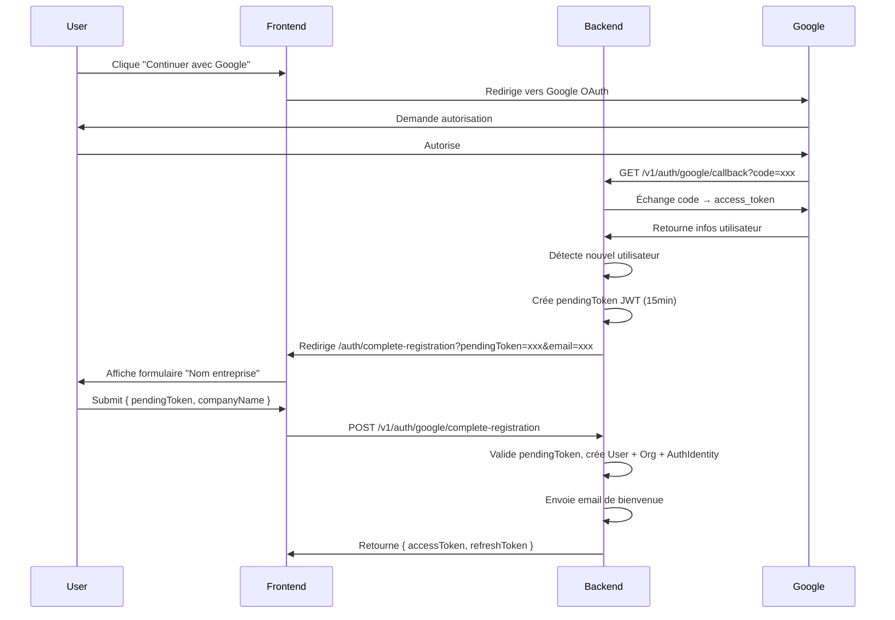
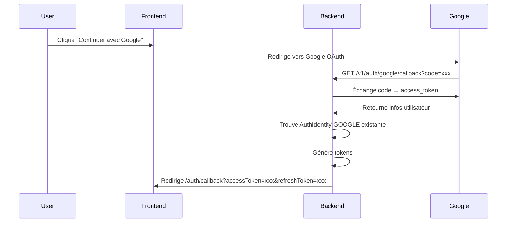
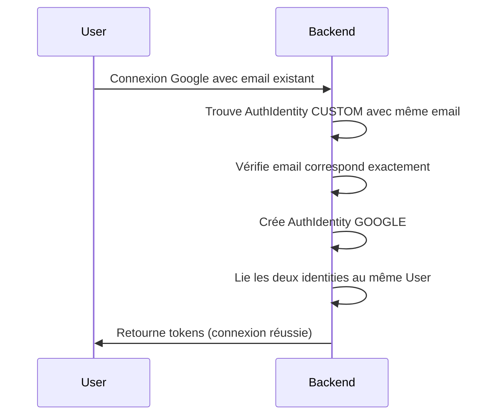

# Documentation : Authentification Google OAuth2

## Vue d'ensemble

Cette documentation explique l'implémentation de l'authentification Google OAuth2 dans le système Izzzi. L'implémentation suit l'architecture DDD/Clean Architecture et respecte les patterns existants du projet.

## Architecture

L'implémentation suit la séparation des couches DDD :

- **Domain** : Types, interfaces, entités (pas de framework)
- **Application** : Use cases, facades
- **Infrastructure** : Adapters, repositories
- **Interface** : Controllers, DTOs

## Flow d'authentification

### 1. Nouvel utilisateur



### 2. Utilisateur existant (connexion directe)



### 3. Linking de comptes

Si un utilisateur avec un compte CUSTOM (email/password) se connecte via Google avec le même email :



## Configuration

### Variables d'environnement requises

Ajoutez ces variables dans votre fichier `.env` :

```env
# Google OAuth2
GOOGLE_CLIENT_ID=your-google-client-id.apps.googleusercontent.com
GOOGLE_CLIENT_SECRET=your-google-client-secret
GOOGLE_CALLBACK_URL=http://localhost:3000/api/v1/auth/google/callback

# Frontend (pour les redirections)
FRONTEND_DOMAIN_URL=http://localhost:3001
```

### Configuration Google Cloud Console

1. **Créer un projet** dans [Google Cloud Console](https://console.cloud.google.com/)

2. **Activer l'API Google+** :
   - Aller dans "APIs & Services" > "Library"
   - Rechercher "Google+ API" et l'activer

3. **Créer des identifiants OAuth 2.0** :
   - Aller dans "APIs & Services" > "Credentials"
   - Cliquer sur "Create Credentials" > "OAuth client ID"
   - Choisir "Web application"
   - Configurer :
     - **Name** : Izzzi Backend
     - **Authorized JavaScript origins** : `http://localhost:3000` (dev) ou votre domaine (prod)
     - **Authorized redirect URIs** : `http://localhost:3000/api/v1/auth/google/callback` (dev) ou votre URL de production

4. **Récupérer les identifiants** :
   - **Client ID** : Copier dans `GOOGLE_CLIENT_ID`
   - **Client Secret** : Copier dans `GOOGLE_CLIENT_SECRET`

### Configuration du callback URL

Le `GOOGLE_CALLBACK_URL` doit correspondre exactement à l'URL configurée dans Google Cloud Console :

- **Développement** : `http://localhost:3000/api/v1/auth/google/callback`
- **Production** : `https://api.votredomaine.com/api/v1/auth/google/callback`

**Important** : Le préfixe `/api` est nécessaire car l'application NestJS utilise `setGlobalPrefix("api")`.

## Endpoints API

### 1. GET /v1/auth/google/authorize

Redirige vers l'URL d'autorisation Google.

**Query Parameters** (optionnel) :

- `state` : Paramètre d'état pour le flow OAuth

**Exemple** :

```
GET /v1/auth/google/authorize?state=xyz123
```

**Réponse** : Redirection 302 vers Google

---

### 2. GET /v1/auth/google/callback

Gère le callback Google après l'autorisation.

**Query Parameters** :

- `code` : Code d'autorisation fourni par Google
- `error` : Erreur éventuelle de Google

**Réponses possibles** :

**Succès - Connexion directe** :

```
302 Redirect → /auth/callback?accessToken=xxx&refreshToken=xxx
```

**Succès - Inscription à compléter** :

```
302 Redirect → /auth/complete-registration?pendingToken=xxx&email=xxx&firstName=xxx&lastName=xxx
```

**Erreur** :

```
302 Redirect → /auth/error?error=GOOGLE_AUTH_FAILED
```

---

### 3. POST /v1/auth/google/complete-registration

Complète l'inscription d'un nouvel utilisateur Google.

**Body** :

```json
{
  "pendingToken": "eyJhbGciOiJIUzI1NiIsInR5cCI6IkpXVCJ9...",
  "companyName": "Acme Corp"
}
```

**Réponse** :

```json
{
  "accessToken": "eyJhbGciOiJIUzI1NiIsInR5cCI6IkpXVCJ9...",
  "refreshToken": "a1b2c3d4e5f6g7h8i9j0k1l2m3n4o5p6q7r8s9t0u1v2w3x4y5z6"
}
```

**Erreurs possibles** :

- `400` : Token invalide ou expiré
- `400` : Nom d'entreprise invalide
- `409` : Compte déjà existant

---

### 4. GET /v1/auth/providers

Retourne les providers d'authentification liés à l'utilisateur connecté.

**Headers** :

- `Authorization: Bearer <accessToken>`

**Réponse** :

```json
{
  "providers": ["CUSTOM", "GOOGLE"],
  "canChangePassword": true,
  "canLinkGoogle": false
}
```

**Champs** :

- `providers` : Liste des providers liés au compte
- `canChangePassword` : `true` si l'utilisateur a un compte CUSTOM
- `canLinkGoogle` : `true` si l'utilisateur n'a pas encore de compte Google

## Restrictions et règles métier

### Restrictions password

Les utilisateurs avec **uniquement** un compte Google ne peuvent pas :

- ❌ Changer de mot de passe (`POST /v1/auth/password/change`)
- ❌ Demander une réinitialisation (`POST /v1/auth/password/forgot`)
- ❌ Réinitialiser le mot de passe (`POST /v1/auth/password/reset`)

Ces endpoints retourneront l'erreur : `PASSWORD_OPERATIONS_NOT_ALLOWED_FOR_GOOGLE`

**Note** : Si un utilisateur a à la fois un compte CUSTOM et Google, il peut utiliser les fonctionnalités password.

### Linking de comptes

**Règles** :

1. Un utilisateur avec un compte CUSTOM peut se connecter via Google
2. Les emails doivent correspondre **exactement** (case-insensitive)
3. Les deux identities sont liées au même User
4. L'utilisateur peut ensuite se connecter via CUSTOM ou Google

**Exemple** :

- Compte CUSTOM : `user@example.com` / password
- Connexion Google : `user@example.com` → Les comptes sont liés automatiquement

### Email vérifié

Les comptes Google sont automatiquement considérés comme **email vérifié** (`isEmailVerified = true`) car Google vérifie les emails avant l'autorisation.

## Structure des fichiers

### Domain Layer

```
src/modules/auth/domain/
├── types.ts                          # Types Google (GoogleUserInfo, GoogleAuthResult, PendingTokenPayload)
├── entities/
│   └── authIdentity.entity.ts        # Méthode isGoogleProvider()
└── repositories/
    └── authIdentity.repository.ts    # findByProviderAndProviderUserId(), findAllByUserId()
```

### Infrastructure Layer

```
src/modules/auth/infrastructure/
├── adapters/
│   └── google-auth.adapter.ts        # GoogleAuthAdapter (implémente IAuthStrategy)
└── repositories/
    └── authIdentity.repository.ts    # Implémentation des nouvelles méthodes
```

### Application Layer

```
src/modules/auth/application/
├── use-cases/
│   ├── HandleGoogleCallback.use-case.ts
│   └── CompleteGoogleSignUp.use-case.ts
└── facades/
    └── auth.facade.ts                # Méthodes Google OAuth
```

### Interface Layer

```
src/modules/auth/interface/
├── controllers/
│   ├── google-auth.controller.ts     # Endpoints Google OAuth
│   └── auth.controller.ts            # GET /v1/auth/providers
└── dto/
    └── google-auth.dto.ts            # CompleteGoogleRegistrationDto
```

## PendingToken

Le `pendingToken` est un JWT temporaire créé lorsqu'un nouvel utilisateur Google doit compléter son inscription.

**Contenu** :

```typescript
{
  type: "google_pending_registration",
  googleId: string,
  email: string,
  firstName?: string,
  lastName?: string,
  picture?: string
}
```

**Expiration** : 15 minutes

**Utilisation** : Permet de stocker temporairement les informations Google entre le callback et la complétion de l'inscription.

## Gestion des erreurs

### Codes d'erreur

- `GOOGLE_AUTH_FAILED` : Échec de l'authentification Google
- `INVALID_PENDING_TOKEN` : Token invalide ou expiré
- `PASSWORD_OPERATIONS_NOT_ALLOWED_FOR_GOOGLE` : Tentative d'utiliser les fonctionnalités password avec un compte Google-only
- `METHOD_NOT_SUPPORTED` : Méthode non supportée pour Google (signUp, signIn, etc.)

### Gestion des erreurs dans le callback

Le callback gère automatiquement les erreurs et redirige vers le frontend avec un message d'erreur :

```
GET /v1/auth/google/callback?error=access_denied
→ Redirect: /auth/error?error=access_denied
```

## Sécurité

### Validations

1. **Code Google** : Validé côté serveur avec `google-auth-library`
2. **Email vérifié** : Vérification que `verified_email === true`
3. **PendingToken** : Signature JWT vérifiée, expiration de 15 minutes
4. **Linking** : Vérification exacte de l'email avant de lier les comptes

### Bonnes pratiques

- ✅ Ne jamais faire confiance aux données du client
- ✅ Valider tous les tokens côté serveur
- ✅ Utiliser HTTPS en production
- ✅ Limiter la durée de vie des tokens temporaires
- ✅ Vérifier l'email Google avant de créer un compte

## Tests

### Scénarios à tester

1. **Nouvel utilisateur** : Flow complet avec saisie du nom d'entreprise
2. **Utilisateur existant** : Connexion directe avec Google
3. **Linking** : Connexion Google avec compte CUSTOM existant
4. **Erreurs** : Token expiré, code invalide, email non vérifié
5. **Restrictions** : Tentative de changement de mot de passe avec compte Google-only

## Dépannage

### Erreur : "Invalid redirect URI"

**Cause** : L'URL de callback ne correspond pas à celle configurée dans Google Cloud Console.

**Solution** : Vérifier que `GOOGLE_CALLBACK_URL` correspond exactement à l'URL dans Google Cloud Console.

### Erreur : "Google email is not verified"

**Cause** : L'email Google n'est pas vérifié.

**Solution** : L'utilisateur doit vérifier son email Google avant de pouvoir se connecter.

### Erreur : "Invalid or expired pending token"

**Cause** : Le pendingToken a expiré (15 minutes) ou est invalide.

**Solution** : L'utilisateur doit recommencer le flow OAuth.

## Migration et compatibilité

### Compatibilité avec l'existant

- ✅ Compatible avec les comptes CUSTOM existants
- ✅ Support du linking automatique
- ✅ Pas de breaking changes
- ✅ Les utilisateurs CUSTOM peuvent continuer à utiliser leur mot de passe

### Migration de données

Aucune migration nécessaire. Les nouvelles `AuthIdentity` avec `provider = 'GOOGLE'` sont créées automatiquement.

## Support

Pour toute question ou problème :

- **Documentation technique** : Voir les fichiers source dans `src/modules/auth/`
- **Issues** : Créer une issue sur le repository
- **Logs** : Vérifier les logs de l'application pour les erreurs détaillées
